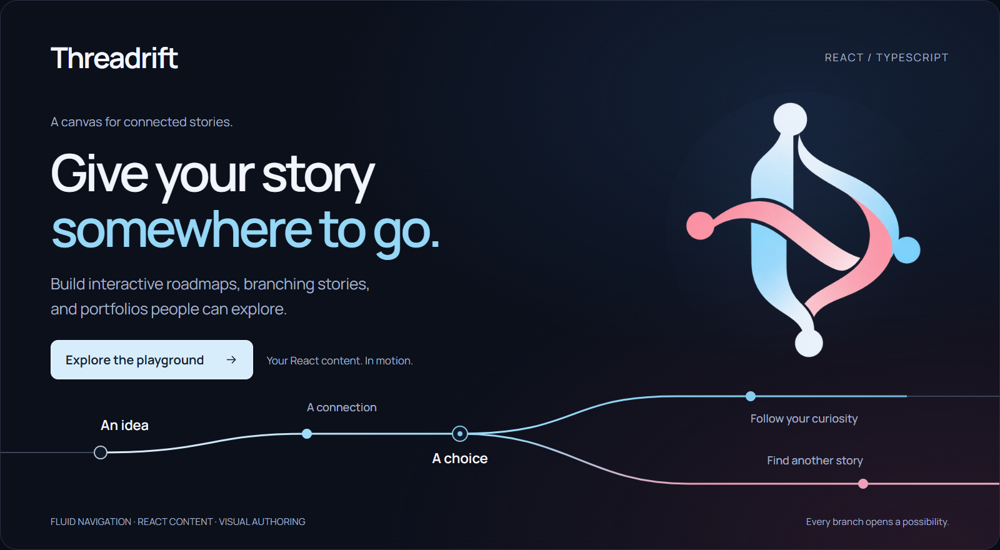

<a href="#try-the-playground">
  <picture>
    <source media="(prefers-color-scheme: dark)" srcset="assets/brand/readme-dark.png">
    <source media="(prefers-color-scheme: light)" srcset="assets/brand/readme-light.png">
    
  </picture>
</a>

# Threadrift

**Turn connected content into a journey people can follow.**

Threadrift is a React engine for spatial storytelling. Place your content on nodes, connect them with flowing paths, and let visitors scroll, swipe, or use the keyboard to travel through the story. At a fork, they can choose what to explore next.

**[Try the playground ↓](#try-the-playground)** · [Build a story](#bring-your-react-content) · [Documentation](DOCUMENTATION.md) · [Camera authoring](CAMERA.md)

## A different way to tell the story

Imagine a portfolio where each project opens into its process. A roadmap where people follow the work that matters to them. A story that offers another perspective at the next fork.

Threadrift gives those connections a place, a path, and a sense of movement.

| You bring | Threadrift brings |
| --- | --- |
| Ideas worth connecting | Smooth, path-constrained travel through your graph |
| Stories with more than one direction | Branches, recommended routes, and intentional choices at nodes |
| Your own React components | Node-relative HTML anchors that retain native interaction and their own styling |
| A composition worth exploring | Saved camera views and adjustable transitions between them |
| A work in progress | An embedded visual editor with graph editing, export, autosave, and recovery drafts |

## Try the playground

Use **Bun 1.3.14**, the workspace's declared package manager, and a full local checkout containing `apps/playground`.

```bash
bun install
bun run build
bun dev
```

Open **[localhost:3000](http://localhost:3000)**. Scroll into the map, stop at a junction, and choose another route. Then open Studio, select a node, and start shaping your own journey.

> **Checkout note:** `apps/playground` currently lives in a separate local Git checkout and is not tracked by the root repository. The playground steps require that directory to be present; cloning the root repository alone does not currently provide the complete demo workspace. The library packages are in this repository.

The initial build prepares the library outputs before the development watchers start. The playground saves authoring changes to its local graph file; export a copy from Studio before experimenting with a map you want to keep.

## Bring your React content

The engine owns the route. Your components own their content and appearance.

The example below runs inside the workspace's Tailwind-enabled playground. It provides its own graph and disables persistence, so it needs no graph API endpoint. In another host, configure Tailwind to scan the React and Studio package sources as `apps/playground/tailwind.config.ts` does.

```tsx
"use client";

import type { GraphJSON } from "@threadrift/core";
import { Threadrift, ThreadriftApp } from "@threadrift/react";
import { EditorPanel, EditorToggle } from "@threadrift/studio";

const story: GraphJSON = {
  version: "4.0",
  nextNodeId: 2,
  root: 0,
  nodes: {
    "0": { id: 0, name: "An idea", content: "", x: 0, y: 0 },
    "1": { id: 1, name: "The next chapter", content: "", x: 480, y: -320 },
  },
  edges: [{ id: "opening", from: 0, to: 1, type: "main", curve: 0 }],
};

export default function MyStory() {
  return (
    <main className="relative h-screen overflow-hidden bg-zinc-950 text-white">
      <Threadrift.Root initialData={story} persistence={false}>
        <ThreadriftApp>
          <Threadrift.Node id={0}>
            <article className="rounded-2xl border border-sky-200/20 bg-zinc-900 p-6">
              <h1 className="text-2xl font-semibold">Every story starts somewhere.</h1>
              <p className="mt-3 text-zinc-300">Scroll to follow this one.</p>
            </article>
          </Threadrift.Node>
          <Threadrift.Node id={1}>
            <h2 className="text-3xl font-semibold">Now make it yours.</h2>
          </Threadrift.Node>
        </ThreadriftApp>
        <EditorPanel />
        <EditorToggle />
      </Threadrift.Root>
    </main>
  );
}
```

`Threadrift.Node` is a position-only container. Set offsets and layout width in the selected node's **Anchors** controls; keep sizing, typography, and styling on your own components. Anchored content stays in CSS pixels as the camera moves.

## Shape it in Studio

Select a node or an edge to reveal its inspector. Add branches, join paths, bend curves, position content, and set camera views directly in the map.

- **Nodes:** edit content, create main or branch children, choose recommended exits, and merge into valid destinations.
- **Edges:** adjust curve shape, divergence, and camera transition timing.
- **Camera:** freeze the view while editing, capture a composition, or return to following the route.
- **Persistence:** export JSON, save manually, enable autosave, and recover browser drafts. The playground's local endpoint protects against conflicting writes.

Saved documents use **v4**. Older v1/v2/v3 maps migrate on load. See [persistence and recovery](PERSISTENCE.md) and [camera authoring](CAMERA.md) for the complete contracts.

## Explore naturally

| Input | Action |
| --- | --- |
| Mouse wheel / trackpad | Travel forward and backward on the active route |
| Touch | Swipe up to advance; swipe down to return |
| Keyboard | Focus the map, then use Up/Down or PageUp/PageDown |
| Previous / Next | Move between stops with the on-screen controls |
| Change route | Choose a destination while resting at a junction |

Forward travel follows the selected or recommended route. Explicit turns happen at exact node rest. Reverse travel follows the edges you actually took, and reduced-motion preferences remove travel interpolation.

<details>
<summary><strong>Detailed navigation and embedding behavior</strong></summary>

`Threadrift.Node` is an unstyled positioning container for your React content. Its top-left starts 24px right and below its node by default; Studio → selected node → Anchors edits X/Y and width per node. `(0, 0)` aligns it exactly with the node. Width defaults to 320 CSS pixels, height grows with normal-flow content, and canvas motion does not scale your component. Put visual styling on your child component; use `width: 100%` when it should fill the anchor. Existing v1/v2/v3 maps migrate to v4 with offsets preserved, legacy anchor scaling removed, and saved camera views absent unless authored.

- **Trackpad / Mouse Wheel**: Vertical scrolling travels forward/backward along the selected route. Horizontal input never silently selects another route. Wheel units are normalized, and input is scoped to the map.
- **Junctions**: Continue through the preselected route without a mandatory choice. Priority is your explicit choice, then the author's recommended path, then the straightest continuation relative to the previous node. Equally straight exits prefer the closest destination, then a stable edge ID. At the root, where there is no incoming direction, a main exit is preferred.
- **Node & Edge Clicking**:
  - *Editor OFF*: Path changes are accepted only when scrolling is completely at rest on a node: input is idle and both the target and camera progress have snapped to that exact node.
  - Only routes reachable forward from the resting node can be selected. The travelled path through that node is preserved; clicks between nodes, while settling, or toward a fork already passed do nothing. This applies at every branch depth.
  - Clicking an edge selects that exact connection, including parallel edges and merges. Clicking a future node confirms the route to it, retaining existing planned detours. Selection never moves the camera.
  - *Editor ON*: Clicks select nodes/edges for property inspection and live dragging without also changing the navigation route. Wheel scrolling, swiping on empty canvas, and focused-map keyboard navigation remain available. The camera follows the current node during dragging; only an active node drag temporarily owns motion. Editor fields and panels retain their own scrolling and keyboard input.
- **Touch / Mobile**: Swipe up to advance, down to retreat. Continuous movement follows the whole swipe. A drag is not a tap. Pinch remains available to the browser, and anchored HTML content keeps native interaction.
- **Keyboard / Buttons**: Focus the map and use Up/Down or PageUp/PageDown, or use Previous/Next. Focus destination buttons and press Enter/Space to select. Reduced-motion preferences remove travel interpolation.

Navigation is a small icon row shown at rest. At a junction, **Change route** opens a compact list of destinations; choosing closes it. The controls disappear during travel. Previous/Next and focused-viewer keyboard navigation remain available without opening the route list.

Reverse travel follows the exact edges taken and briefly stops at earlier forks. A fresh swipe continues immediately. Wheel input has a fixed 90 ms pause after arrival, never extended by further samples; a fresh non-momentum burst can bypass it. Wheel gesture separation uses a 90 ms quiet interval and a 40 ms gap shortcut at reverse stops. These timings are input heuristics, not proof of physical gesture boundaries. Route changes still require exact node rest and preserve the travelled prefix.

In **Studio → Node → Recommended path**, choose **Automatic · straightest continuation** or an outgoing destination. The latter saves `recommendedEdgeId` on that node in JSON. Removing the recommended connection restores automatic routing. Existing JSON without this optional field uses automatic routing. Explicit visitor choices always take priority.

Embedded content and custom controls can opt out of navigation with `data-threadrift-ignore`. Custom canvas compositions must mount one `Threadrift.Navigation` alongside `Threadrift.Canvas` per provider. The convenience `ThreadriftApp` includes both.

Imported graphs are validated before being published: a valid root, unique IDs, finite geometry, existing endpoints, and no directed cycles or zero-length connections are required. Failed imports leave the previous graph intact. Valid graph edits cancel active gestures and settle at the last surviving node in the travelled prefix.

</details>

## Inside the workspace

| Package | Responsibility |
| --- | --- |
| [`@threadrift/core`](packages/core) | Graph validation, topology, spline geometry, document contracts, and camera resolution |
| [`@threadrift/react`](packages/react) | React composition, Zustand state, SVG rendering, navigation, and HTML anchors |
| [`@threadrift/studio`](packages/studio) | Contextual node/edge inspectors, camera tools, and persistence controls |
| `apps/playground` | Next.js demo and local persistence endpoint, available in the full local workspace |

The dependency direction is `core → react → studio → playground`. These are local workspace packages; the setup above does not assume published npm releases.

## Go deeper

| Guide | What you will find |
| --- | --- |
| [Documentation](DOCUMENTATION.md) | Package structure, concepts, and API reference |
| [Camera authoring](CAMERA.md) | Saved views, previews, and transition windows |
| [Persistence](PERSISTENCE.md) | Document versions, adapters, recovery, and conflict handling |
| [Browser checks and input verification](packages/react/tests/README.md) | Integration checks and physical-device acceptance guidance |
| [Brand assets](assets/brand/README.md) | Approved logo, dark/light README cards, and editable source |

Build core first, then run the core and React suites:

```bash
bun run --filter @threadrift/core build
bun run --filter @threadrift/core test
bun run --filter @threadrift/react test
```

The tests cover route selection, graph geometry, camera authoring, and persistence behavior. Browser input simulations complement physical-device testing; they do not certify OS gesture momentum.

---

**Have a story with more than one way through it? [Start exploring.](#try-the-playground)**
